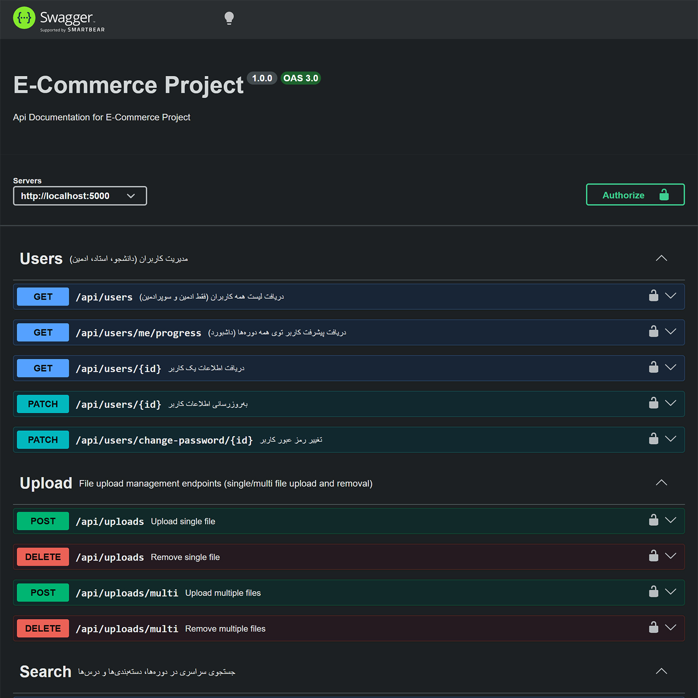
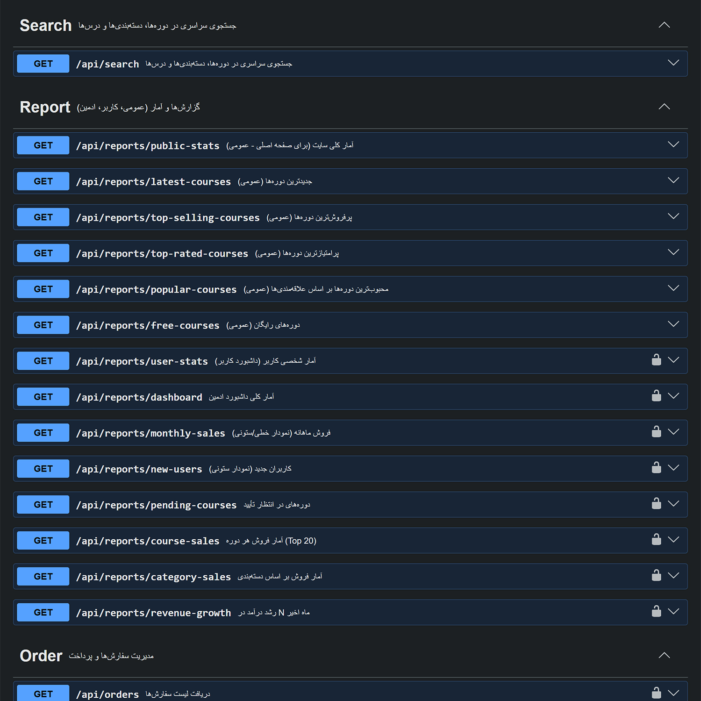
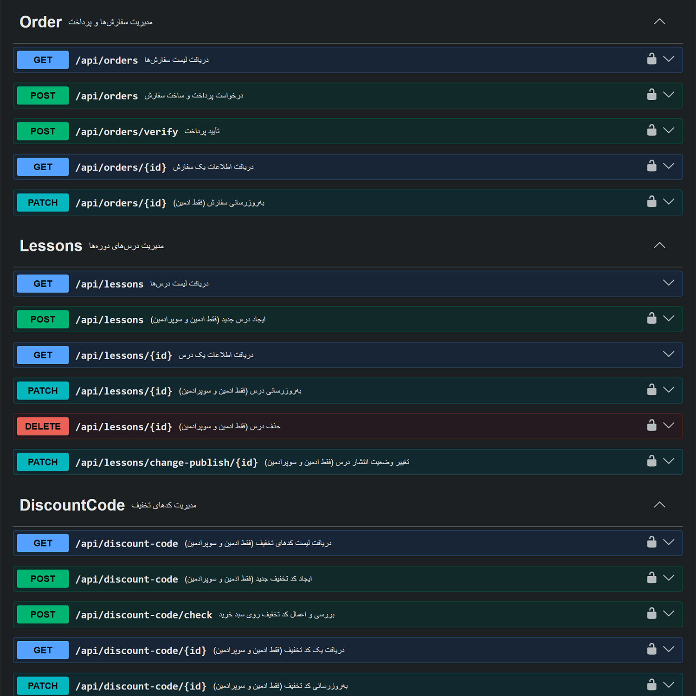
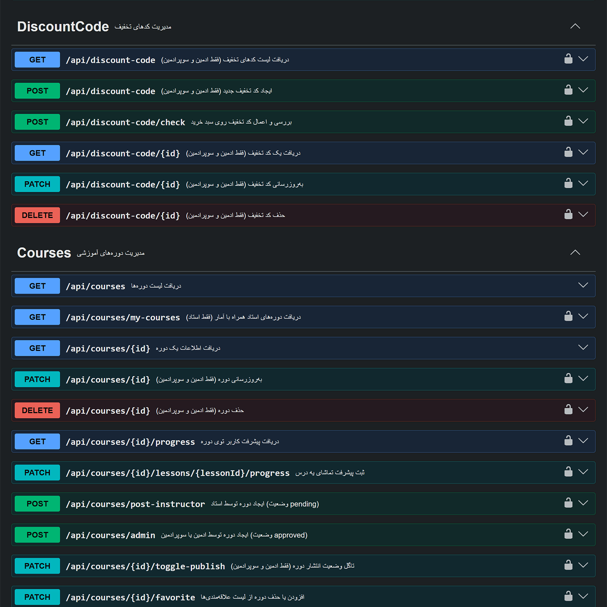
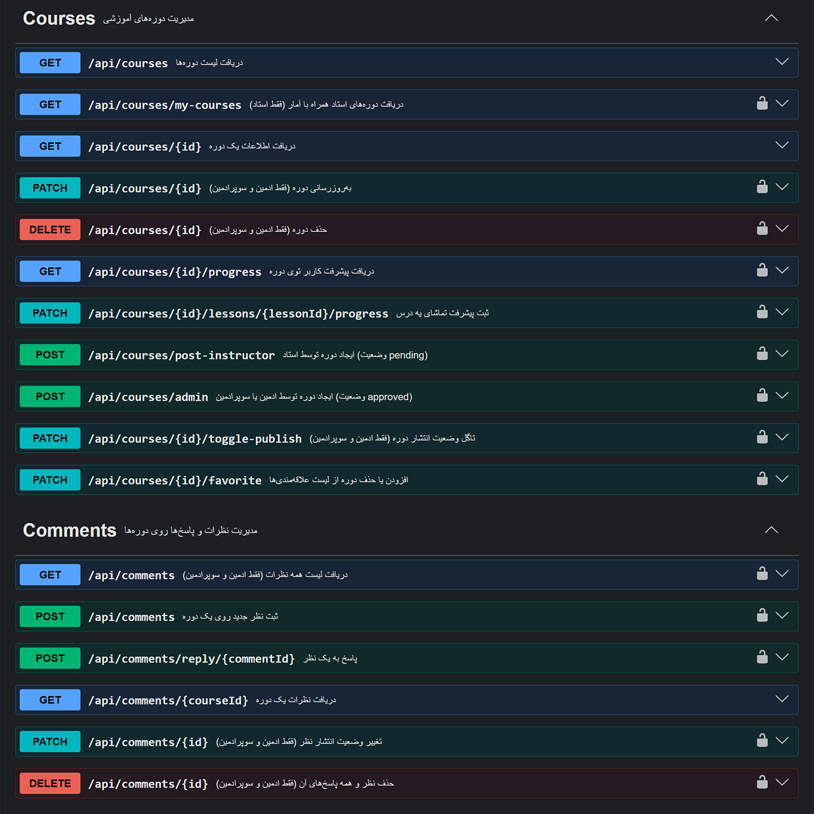
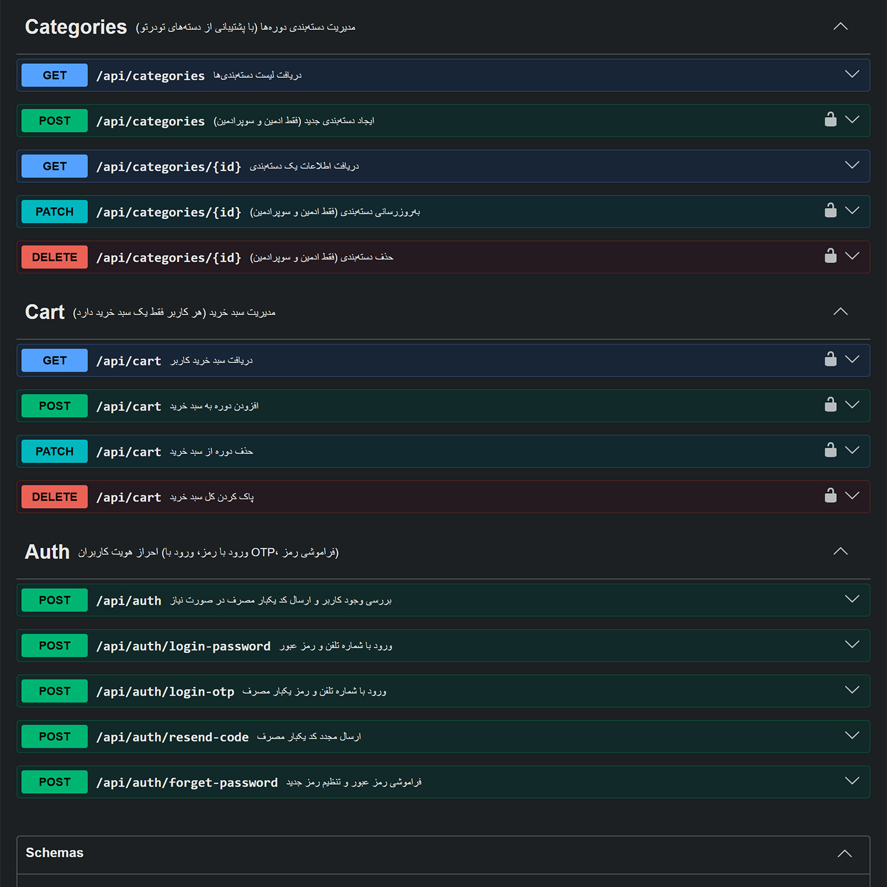
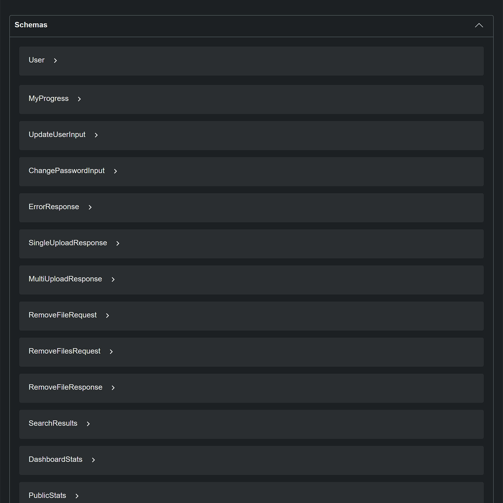

# 🎓 پلتفرم آموزش آنلاین — Backend

<p align="center">
  
  
  
  
  
  
  
</p>

<p align="center">
  <b>یک بک‌اند کامل و حرفه‌ای برای پلتفرم فروش دوره‌های آموزشی</b><br/>
  احراز هویت OTP • سبد خرید • کد تخفیف • پرداخت آنلاین • نظرات • پیشرفت کاربر • داشبورد تحلیلی
</p>

---

## 📸 اسکرین‌شات‌ها

<table align="center">
  <tr>
    <td align="center" width="33%">
      <br/>
      <sub>صفحه اصلی Swagger</sub>
    </td>
    <td align="center" width="33%">
      <br/>
      <sub>  امار و گزارش ها</sub>
    </td>
    <td align="center" width="33%">
      <br/>
      <sub>مدیریت سفارش ها</sub>
    </td>
  </tr>
  <tr>
    <td align="center" width="33%">
      <br/>
      <sub> مدیریت دوره ها</sub>
    </td>
    <td align="center" width="33%">
      <br/>
      <sub>  نظرات کاربران</sub>
    </td>
    <td align="center" width="33%">
      <br/>
      <sub>احراز هویت و سبد خرید</sub>
    </td>
  </tr>
  <tr>
    <td align="center" width="33%">
      <br/>
      <sub>Schema های دیتابیس</sub>
    </td>
    <td colspan="2"></td>
  </tr>
</table>

---

## 📖 فهرست

| # | بخش |
|---|-----|
| 1 | [درباره پروژه](#-درباره-پروژه) |
| 2 | [امکانات](#-امکانات) |
| 3 | [تکنولوژی‌ها](#-تکنولوژیهای-استفادهشده) |
| 4 | [معماری](#-معماری-پروژه) |
| 5 | [ساختار پوشه‌ها](#-ساختار-پوشهها) |
| 6 | [نصب و اجرا](#-نصب-و-اجرا) |
| 7 | [متغیرهای محیطی](#-متغیرهای-محیطی) |
| 8 | [مستندات API](#-مستندات-api) |
| 9 | [نقش‌های کاربری](#-نقشهای-کاربری) |
| 10 | [نکات امنیتی](#-نکات-امنیتی) |

---

## 🎯 درباره پروژه

بک‌اند کامل پلتفرم آموزش آنلاین با معماری **ماژولار** و **RESTful API**:

| نقش | دسترسی |
|------|--------|
| 🎓 **دانشجو** | خرید دوره، تماشا، امتیاز، پیشرفت |
| 👨‍🏫 **استاد** | ایجاد دوره، پاسخ به نظرات |
| 👑 **ادمین** | تأیید دوره، مدیریت کاربران، کد تخفیف، گزارش‌ها |

---

## ✨ امکانات

| ماژول | امکانات |
|-------|---------|
| 🔐 **احراز هویت** | ورود با رمز • ورود با OTP • فراموشی رمز • JWT • RBAC |
| 📚 **دوره‌ها** | CRUD • سیستم تأیید • دسته‌بندی • تگ • پیش‌نیاز • تخفیف خودکار |
| 📂 **دسته‌بندی** | دسته و زیردسته (درختی) • اسلاگ فارسی |
| 🎬 **درس‌ها** | CRUD • ویدیو، عکس، PDF • ترتیب نمایش |
| 💬 **نظرات** | پاسخ تودرتو • امتیاز برای خریداران • تأیید ادمین |
| 📈 **پیشرفت** | ذخیره ثانیه‌ها • درصد خودکار • ادامه یادگیری |
| 🛒 **سبد خرید** | افزودن/حذف • حذف ناموجودها • کد تخفیف |
| 💰 **کد تخفیف** | درصدی و ثابت • زمان‌دار • محدودیت تعداد |
| 💳 **پرداخت** | زرین‌پال • Verify خودکار |
| 🔍 **جستجو** | سراسری در دوره‌ها، دسته‌ها، درس‌ها |
| 📊 **گزارش‌ها** | آمار کلی • فروش ماهانه • پرفروش‌ترین‌ها |
| 📤 **آپلود** | تکی و چندتایی • UUID • محدودیت MIME |

---

## 🛠 تکنولوژی‌های استفاده‌شده

<table>
  <tr>
    <th>دسته</th>
    <th>تکنولوژی</th>
  </tr>
  <tr>
    <td><b>Core</b></td>
    <td>Node.js • Express.js • MongoDB • Mongoose</td>
  </tr>
  <tr>
    <td><b>Auth</b></td>
    <td>JWT • bcrypt • CORS</td>
  </tr>
  <tr>
    <td><b>Upload</b></td>
    <td>Multer • UUID</td>
  </tr>
  <tr>
    <td><b>Utilities</b></td>
    <td>vanta-api • slugify • dotenv • morgan • express-validator</td>
  </tr>
  <tr>
    <td><b>Docs</b></td>
    <td>swagger-jsdoc • swagger-ui-express</td>
  </tr>
  <tr>
    <td><b>Services</b></td>
    <td>Zarinpal (پرداخت) • LimoSMS (پیامک)</td>
  </tr>
</table>

---

## 🏗 معماری پروژه

هر ماژول شامل ۵ فایل:

| فایل | کار |
|------|-----|
| `<module>.js` | Router (مسیرها) |
| `<module>Md.js` | Model (اسکیما) |
| `<module>Cn.js` | Controller (منطق) |
| `<module>Validator.js` | Validation |
| `docs.js` | Swagger Docs |

**جریان درخواست:**
```
Request → Router → Validator → Controller → Model → MongoDB
```

---

## 📁 ساختار پوشه‌ها

```
project/
├── Modules/
│   ├── Auth/            ← احراز هویت
│   ├── User/            ← کاربران
│   ├── Course/          ← دوره‌ها
│   ├── Category/        ← دسته‌بندی
│   ├── Lesson/          ← درس‌ها
│   ├── Comment/         ← نظرات
│   ├── Cart/            ← سبد خرید
│   ├── Order/           ← سفارش و پرداخت
│   ├── DiscountCode/    ← کد تخفیف
│   ├── Upload/          ← آپلود فایل
│   ├── Search/          ← جستجو
│   └── Report/          ← گزارش‌ها
├── Middlewares/         ← isLogin, isAdmin, ...
├── Utils/               ← uploadOption, Swagger, ...
├── Services/            ← Zarinpal, LimoSMS
├── Public/              ← فایل‌های آپلود
├── screenshots/         ← عکس‌های README
├── app.js
├── index.js
└── package.json
```

---

## 🚀 نصب و اجرا

```bash
# 1. کلون
git clone https://github.com/yourname/online-course-backend.git
cd online-course-backend

# 2. نصب
npm install

# 3. کپی .env
cp .env.example .env

# 4. تنظیم .env (پایین توضیح داده شده)

# 5. اجرا
npm run dev
```

| سرویس | آدرس |
|--------|------|
| API | `http://localhost:5000/api` |
| Swagger | `http://localhost:5000/api-docs` |
| Files | `http://localhost:5000/files` |

---

## 🔑 متغیرهای محیطی

```env
PORT=5000
NODE_ENV=development

DATA_BASE=mongodb://localhost:27017/online-course
SECRET_JWT=your_secret_key

SMS_KEY=your_limosms_key

ZARINPAL_MERCHANT_ID=your_merchant_id
ZARINPAL_CALLBACK_URL=http://localhost:5000/api/orders/verify

PUBLIC_DIR=Public
MAX_FILE_SIZE=26214400
```

---

## 📖 مستندات API

**Swagger UI:** `http://localhost:5000/api-docs`

- 🔐 دکمه **Authorize** برای ورود توکن JWT (بدون `Bearer`)
- 🧪 تست آنلاین تمام روت‌ها

### نمونه روت‌ها

| Method | Endpoint | توضیح |
|--------|----------|-------|
| `POST` | `/api/auth/login-otp` | ورود با OTP |
| `POST` | `/api/auth/login-password` | ورود با رمز |
| `GET` | `/api/courses` | لیست دوره‌ها |
| `POST` | `/api/courses/post-instructor` | ایجاد دوره (استاد) |
| `PATCH` | `/api/courses/:id/toggle-publish` | تأیید/رد (ادمین) |
| `POST` | `/api/cart` | افزودن به سبد |
| `POST` | `/api/discount-code/check` | بررسی کد تخفیف |
| `POST` | `/api/orders` | درخواست پرداخت |
| `POST` | `/api/orders/verify` | تأیید پرداخت |
| `GET` | `/api/reports/dashboard` | آمار داشبورد |

---

## 👥 نقش‌های کاربری

| نقش | دسترسی‌ها |
|------|-----------|
| 🎓 **Student** | خرید • تماشا • امتیاز • علاقه‌مندی • پیشرفت |
| 👨‍🏫 **Instructor** | ایجاد دوره (pending) • پاسخ نظرات |
| 👑 **Admin** | تأیید دوره • مدیریت کاربران • کد تخفیف • گزارش |
| 👑 **SuperAdmin** | همه + تغییر نقش • حذف کاربران |

---

## 🔒 نکات امنیتی

| مورد | پیاده‌سازی |
|------|-------------|
| رمز عبور | bcrypt (10 rounds) |
| JWT | انقضا 30 روزه |
| OTP | اعتبار 5 دقیقه |
| آپلود | محدودیت MIME + Size |
| Rate Limit | روی OTP |
| XSS | اعتبارسنجی ورودی |
| NoSQL Injection | Mongoose validation |

---

## 🤝 Contributing

1. Fork
2. Branch (`git checkout -b feature/amazing`)
3. Commit (`git commit -m 'Add amazing'`)
4. Push (`git push origin feature/amazing`)
5. Pull Request

---

## 📄 License

**MIT**

---

## 👨‍💻 سازنده

| پلتفرم | آدرس |
|--------|------|
| GitHub | [@nazikdl](https://github.com/yourname) |
| Email | your.nazikdl2@example.com |

---

<p align="center">
  <b>⭐ اگه پروژه برات مفید بود، یه ستاره بده! ⭐</b><br/>
  ساخته‌شده با ❤️ و ☕
</p>